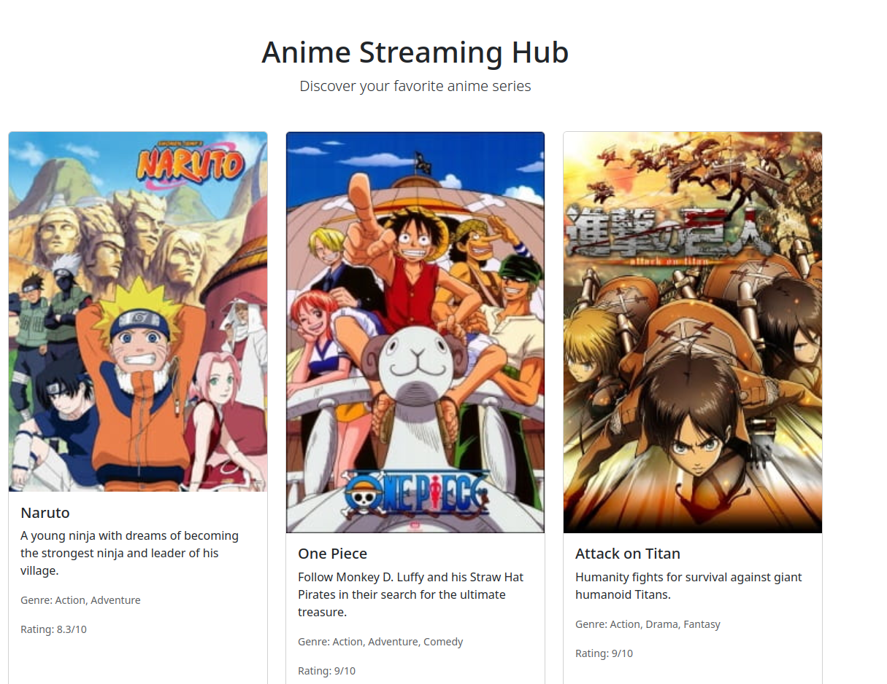
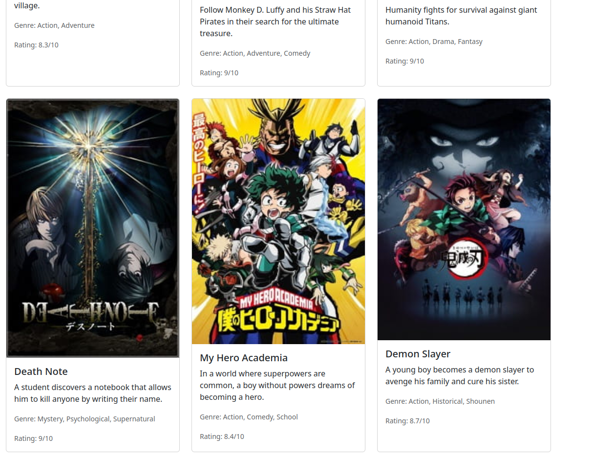

# Anime-Hub: Multi-Library UI Showcase

A professional Single Page Application (SPA) built with **React** and **Vite** that demonstrates the successful integration of two major UI component libraries: **Bootstrap 5** and **Material UI (MUI)**. This project fulfills the requirements for a series of academic lab experiments focusing on modern web design, component-based architecture, and library interoperability.

---

## 🚀 Project Overview
The "Anime-Hub" platform is designed to showcase popular anime series through a modern web interface. It serves as a practical implementation of:
- **Responsive Layouts**: Ensuring the UI adapts to mobile, tablet, and desktop screens.
- **Library Integration**: Combining Bootstrap's utility-first approach with Material UI's design-system approach.
- **Dynamic Rendering**: Using React's state and mapping capabilities to display data.

---

## 🧪 Detailed Experiments Summary

### Experiment-1: Designing UI Using Bootstrap Components
- **Aim**: To design a responsive user interface using Bootstrap in an SPA.
- **Status**: ✅ Completed.
- **Technical Detail**: Integrated Bootstrap 5 via npm and utilized core components like buttons, typography, and container systems to build the base UI.

### Experiment-2: Card-Based Layout Using Bootstrap
- **Aim**: To create a card-based UI layout using Bootstrap components.
- **Status**: ✅ Completed.
- **Technical Detail**: Implemented a dynamic grid system (`row`, `col`) to render an array of anime data (Attack on Titan, Death Note, Demon Slayer) into clean, centered Bootstrap cards.

### Experiment-3: UI Design Using Material UI Components
- **Aim**: To design a user interface using Material UI components in React.
- **Status**: ✅ Completed.
- **Technical Detail**: Developed an "MUI Exclusive Services" section using `@mui/material`. This section showcases MUI-specific features like `Paper` for elevation, `Card` for content containment, and a vertical `Grid` stack for specialized information.

### Experiment-4: Responsive Navigation Bar
- **Aim**: To design a responsive navigation bar using a UI component library.
- **Status**: ✅ Completed.
- **Technical Detail**: Built a dark-themed header with navigation links that adjust automatically to different screen sizes, providing a consistent entry point for the application.

---

## 🛠️ Technology Stack & Requirements
- **Core**: React 18+ (Vite)
- **Styling**: 
  - Bootstrap 5.3+
  - Material UI 6.0+ (MUI)
- **Runtime**: Node.js (Recommended v20.19.0+ or v22.12.0+)
- **IDE**: Visual Studio Code / Cascade

---

## 📂 Project Structure
\`\`\`
Exp-2/
├── src/
│   ├── assets/          # Anime poster images
│   ├── Navbar.jsx       # Experiment-4: Responsive Header
│   ├── App.jsx          # Experiment-1, 2, & 3: Main Layout
│   ├── App.css          # Styling for App component
│   ├── index.css        # Global styles
│   └── main.jsx         # App entry point
├── public/              # Static assets
├── index.html           # HTML template
├── package.json         # Dependencies and scripts
├── vite.config.js       # Vite configuration
├── eslint.config.js     # ESLint configuration
└── README.md            # This file
\`\`\`

---

## 🚀 Getting Started

### Prerequisites
- Node.js v20.19.0+ or v22.12.0+
- npm (comes with Node.js)

### Installation & Setup
1. **Navigate to the project directory:**
   \`\`\`bash
   cd Exp-2
   \`\`\`

2. **Install dependencies:**
   \`\`\`bash
   npm install
   \`\`\`

3. **Start the development server:**
   \`\`\`bash
   npm run dev
   \`\`\`

4. **Open your browser** and navigate to the local server URL (typically \`http://localhost:5173\`)

---
### Image1

### Image2

## 📦 Available Scripts

- **\`npm run dev\`** - Start the development server with hot module replacement (HMR)
- **\`npm run build\`** - Build the project for production
- **\`npm run preview\`** - Preview the production build locally
- **\`npm run lint\`** - Run ESLint to check code quality

---

## 🎨 Features

- **Bootstrap Card Layout**: Responsive card-based grid displaying anime series with images and descriptions
- **Material UI Services Section**: Professional services cards with elevation and Material Design styling
- **Responsive Navigation**: Dynamic navbar that adapts to screen size using MUI AppBar
- **Modern Styling**: Combines Bootstrap utilities with MUI theming for a cohesive design
- **Component-Based Architecture**: Modular React components for better maintainability

---

## 📝 Key Components

| Component | Purpose |
|-----------|---------|
| \`App.jsx\` | Main component containing both Bootstrap and MUI sections |
| \`Navbar.jsx\` | Responsive navigation header built with Material UI |
| \`index.css\` | Global styles and responsive design utilities |
| \`App.css\` | Component-specific styling |

---

## 🔧 Configuration Files

- **\`vite.config.js\`**: Vite build configuration
- **\`eslint.config.js\`**: Code quality linting rules
- **\`package.json\`**: Project metadata and dependencies

---

## 📚 Dependencies

- **React 18+**: UI library for building components
- **Bootstrap 5.3+**: Utility-first CSS framework
- **Material UI 6.0+**: Professional component library
- **Vite**: Fast build tool and dev server

---

## 🎓 Learning Outcomes

This project demonstrates:
- Integration of multiple UI libraries in a single React application
- Responsive design principles and mobile-first approach
- Component composition and React best practices
- CSS framework interoperability (Bootstrap + MUI)
- Modern development workflow with Vite and npm

---

## 👤 Author Information
Academic Lab Experiment Project | Full Stack II Course

---

## 📄 License
This project is part of an academic curriculum.
