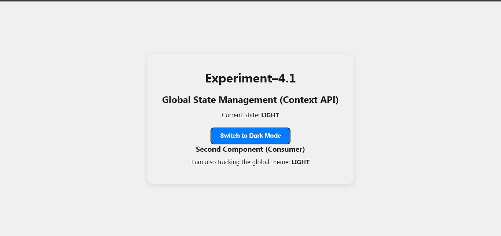
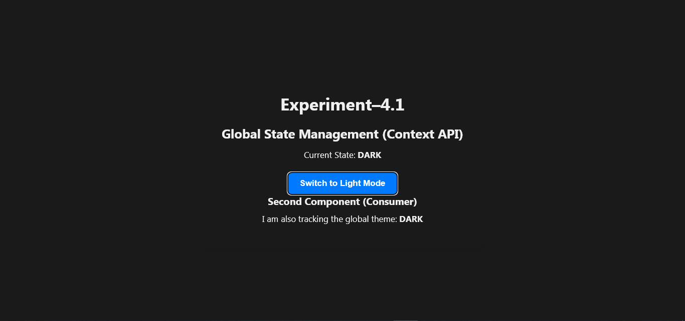

# Experiment–1: Global State Management Using React Context API

> **A Single Page Application demonstrating global state management with React's built-in Context API — no third-party libraries required.**

---

## 📖 Introduction

Managing state across multiple components in React can quickly become messy through **prop drilling** — passing data down through many layers of components manually. The **React Context API** solves this by providing a way to share data globally across your component tree without threading props at every level.

This experiment implements a **Light/Dark theme toggle** as a real-world demonstration of global state. Two independent consumer components both read from and react to the same global context, showing how Context keeps UI in sync effortlessly.

**Key Concepts & Keywords:**
- `createContext()` — creates a Context object
- `Context.Provider` — wraps the app and supplies the global value
- `useContext()` — hook to consume context inside any functional component
- **Global State** — shared application-wide data (theme, user session, language, etc.)
- **Consumer Components** — components that subscribe to context updates
- **Prop Drilling** — the anti-pattern this experiment replaces

---

## 🖼️ Preview

**Light Mode**



*Current State shows LIGHT — the background is white and the button offers "Switch to Dark Mode".*

**Dark Mode**



*Current State switches to DARK — the background turns dark and the button changes to "Switch to Light Mode". Both consumer components update simultaneously.*

---

## ⚡ Quick Start (End Users — No Coding Required)

Follow these steps to download and run the project on your machine. You only need a terminal.

**Prerequisites — install these once:**

1. **Install Node.js** (version 20.19 or 22.12+)
   - Download from: https://nodejs.org
   - Choose the **LTS** version and run the installer

2. **Verify installation** — open your terminal/command prompt and run:
   ```
   node --version
   npm --version
   ```
   Both commands should print a version number.

**Download & Run the project:**

```bash
# 1. Clone the repository
git clone https://github.com/your-username/FSD_exp-4.git

# 2. Move into the project folder
cd FSD_exp-4

# 3. Install dependencies
npm install

# 4. Start the app
npm run dev
```

5. Open your browser and go to: **http://localhost:5173**
6. Click **"Switch to Dark Mode"** / **"Switch to Light Mode"** to see the global state update live.

> ℹ️ **Note:** If you see a warning about Node.js version, upgrade to Node.js 20.19+ or 22.12+ from https://nodejs.org for best results.

---

## 🛠️ Developer Setup (Local Development & Build)

### 1. Fork & Clone

```bash
git clone https://github.com/your-username/FSD_exp-4.git
cd FSD_exp-4
```

### 2. Install Dependencies

```bash
npm install
```

### 3. Run in Development Mode

```bash
npm run dev
```
The Vite dev server starts at `http://localhost:5173` with hot module replacement.

### 4. Build for Production

```bash
npm run build
```
Compiled output is placed in the `dist/` folder.

### 5. Preview the Production Build

```bash
npm run preview
```

### Project Structure

```
FSD_exp-4/
├── public/
├── screenshot1/
│   ├── img1.png          # Dark mode screenshot
│   └── img2.png          # Light mode screenshot
├── src/
│   ├── AppContext.jsx     # Context creation & Provider
│   ├── App.jsx           # Root component (wraps with Provider)
│   ├── Display.jsx       # Consumer component
│   ├── App.css
│   └── index.css
├── main.jsx
├── index.html
├── vite.config.js
└── package.json
```

---

## 🤝 Contributing

Contributions are welcome! Here's how to get involved:

### Submitting a Pull Request

1. **Fork** this repository to your GitHub account
2. **Create a feature branch** from `main`:
   ```bash
   git checkout -b feature/your-feature-name
   ```
3. **Make your changes** and commit with a clear message:
   ```bash
   git commit -m "feat: add user preference persistence to context"
   ```
4. **Push** your branch:
   ```bash
   git push origin feature/your-feature-name
   ```
5. Open a **Pull Request** on GitHub against the `main` branch

### Pull Request Guidelines

- Keep changes focused — one feature or fix per PR
- Include a clear description of *what* and *why*
- Add or update screenshots in `/screenshots` if the UI changes
- Ensure `npm run build` completes without errors before submitting

---

## 📋 Contribution Expectations

To keep the project healthy and welcoming, please follow these expectations:

### Filing Issues

- Search existing issues before opening a new one to avoid duplicates
- Use a clear, descriptive title (e.g., *"Theme state resets on page refresh"*)
- Include steps to reproduce, expected vs actual behavior, and your Node.js / browser version
- Add the appropriate label: `bug`, `enhancement`, `question`, or `documentation`

### Code Contributions

- Follow the existing code style (functional components + hooks, no class components)
- Do not introduce new npm dependencies without discussion in an issue first
- Context logic must remain in `AppContext.jsx` — keep it as the single source of truth
- Components that consume context must use `useContext()` — do not use the legacy `<Context.Consumer>` pattern

### Documentation Contributions

- Typo fixes, clearer explanations, and additional examples are always appreciated
- Update this `README.md` if your change affects setup steps or project structure

---

## 🐛 Known Issues

| # | Issue | Status | Workaround |
|---|-------|--------|------------|
| 1 | **Node.js version warning on startup** — Vite 7.3.1 requires Node.js 20.19+ or 22.12+; running on Node 20.14.0 produces a warning in the terminal | Open | Upgrade Node.js to the latest LTS (22.x) |
| 2 | **Theme does not persist on page refresh** — the global state lives only in React memory; refreshing the browser resets the theme to LIGHT | Open | Future fix: sync state to `localStorage` inside the Provider |
| 3 | **No CSS theme switching** — the background/foreground colors do not change with the theme toggle; only the text label updates | Open | Extend `AppContext.jsx` to apply a CSS class or CSS variable to the root element |
| 4 | **Single context limitation** — the app currently supports only one context (theme); scaling to multiple contexts (e.g., user auth + theme) requires architectural refactoring | Open | Use a context composition pattern or introduce `useReducer` |

---

## 📚 Software Requirements

- Node.js (20.19+ or 22.12+ recommended)
- React 18+
- Vite 7+
- Code Editor: VS Code (recommended)
- Web Browser: Chrome, Firefox, or Edge

---

## 📄 License

This project is created for educational purposes as part of a Full Stack Development lab experiment.