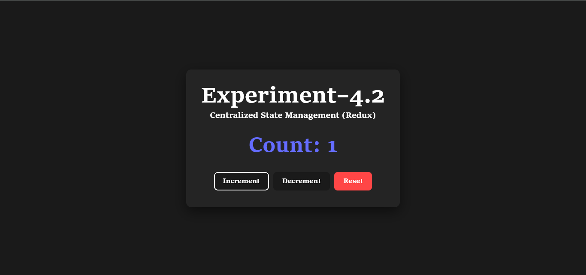
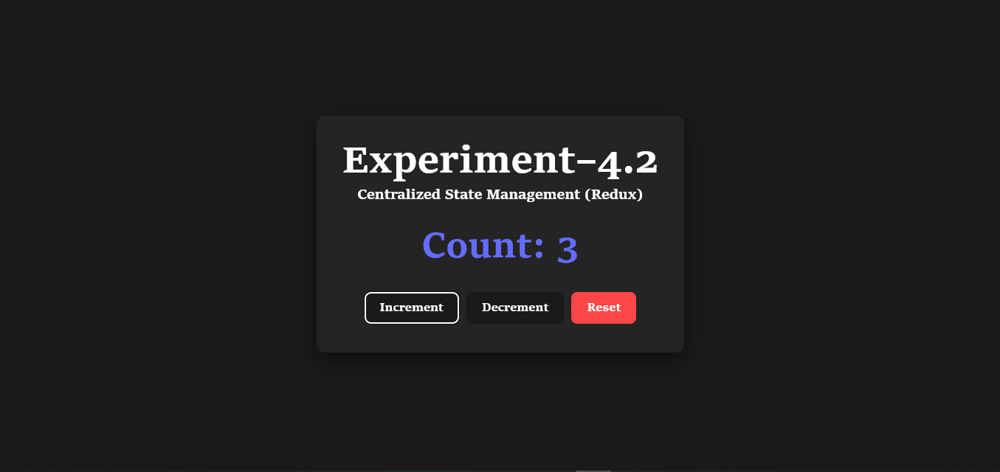

# Experiment 4.2 — Centralized State Management (Redux)

A React + Redux experiment demonstrating centralized state management using Redux Toolkit. The counter app dispatches actions to a Redux store and re-renders automatically via `useSelector`.

## 📸 Screenshots

**Count: -1 — after Decrement below zero**



**Count: 3 — after multiple Increments**



## ⚙️ How It Works

Each button click dispatches an action to the Redux store. The component reads the updated count via `useSelector` and re-renders automatically.

| Button | Action Dispatched |
|--------|-------------------|
| Increment | `counter/increment` |
| Decrement | `counter/decrement` |
| Reset | `counter/reset` |

## 🚀 Getting Started

### Prerequisites
- Node.js (v18+)
- npm or yarn

### Installation

```bash
cd 4.2
npm install
npm run dev
```

## 🗂️ Project Structure

```
4.2/
├── public/
├── screenshots/
│   ├── image1.png
│   ├── image2.png
│   └── image4.png
├── src/
│   ├── App.jsx
│   ├── App.css
│   ├── main.jsx
│   ├── store.js
│   └── counterSlice.js
├── index.html
├── package.json
└── vite.config.js
```

## 🛠️ Tech Stack

- **React** — UI library
- **Redux Toolkit** — State management
- **Vite** — Build tool and dev server